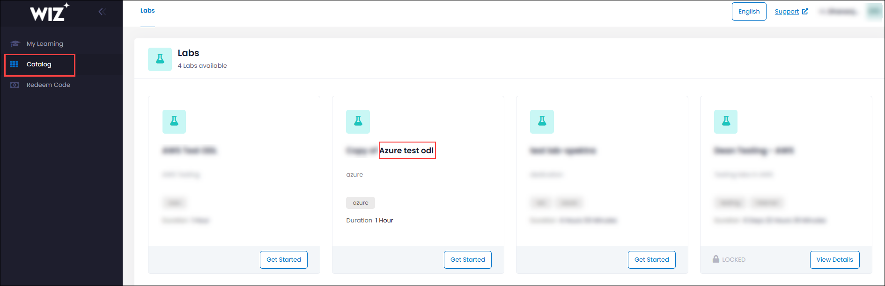
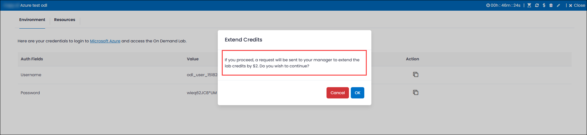

# Grammar Check 

### Overview

The goal is to ensure the tool catches common mistakes like spelling errors, incorrect sentence structure, and punctuation issues, providing a smoother and more professional user experience.

### Prerequisites

Before checking the grammar in the custom portal, make sure the following prerequisites are in place:

- Admin access to [CloudLabs Admin Portal](https://admin.cloudlabs.ai/) (If access is unavailable, kindly reach out to your point of contact or [CloudLabs Support](https://docs.cloudlabs.ai/RequestSupport)).

### Checking Grammar

1. Log in to the Wiz Custom portal and navigate to the **Catalog** section. Then, click on the required lab and press the **Launch** button.

   

2. Once the deployment is complete, the following output will be displayed:

   
